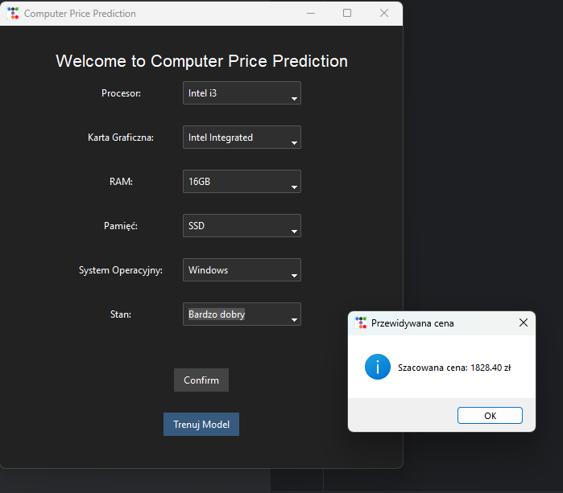

# **Computer Price Prediction**  

A machine learning-based application that predicts the price of used computers based on specifications such as processor, RAM, storage type, graphics card, and condition.  

---

## **Project Overview**  
This project uses **web scraping**, **machine learning**, and a **GUI** to estimate the price of second-hand computers. The key components include:  
- **Data Collection:** Extracting product listings from an online marketplace.  
- **Machine Learning Model:** A regression model trained to predict prices.  
- **User Interface:** A Tkinter-based interface for user interaction.  

---

## **Features**  
- **Web scraping**: Automatically collects real-time data.  
- **Data preprocessing**: Cleans and categorizes extracted information.  
- **Machine Learning**: Uses **Linear Regression** for price prediction.  
- **Graphical User Interface**: User-friendly interface for input and predictions.  
- **Model saving/loading**: Stores trained models for future use.  

---

## **Project Structure**  
```
📂 Computer Price Prediction
│── main.py              # Entry point
│── app.py               # Application logic
│── data.py              # Web scraping and data processing
│── model.py             # Machine learning model
│── user_interface.py    # GUI
│── model.pkl            # Saved trained model (if available)
│── README.md            # Documentation
```

---

## **Installation & Setup**  
### **1. Clone the Repository**  
```sh
git clone https://github.com/OskarBelza/ComputerPricePrediction
cd computer-price-prediction
```

### **2. Install Dependencies**  
```sh
pip install -r requirements.txt
```

### **3. Run the Application**  
```sh
python main.py
```

---

## **How It Works**  
1. **Web Scraping:** `data.py` fetches listings, extracting details like processor, RAM, storage, condition, and price.  
2. **Machine Learning Model:** `model.py` categorizes and encodes features, trains a **Linear Regression** model, and saves it as `model.pkl`.  
3. **GUI Interaction:** Users select specs, and the model predicts an estimated price.  

---

## **Presentation**  


---

## **Dependencies**  
- **Python 3.x**  
- `tkinter`, `ttkbootstrap` (GUI)  
- `requests`, `beautifulsoup4` (Web scraping)  
- `pandas`, `numpy` (Data processing)  
- `scikit-learn` (Machine Learning)  

---

## **Future Improvements**  
- Improve data collection with multiple sources.  
- Enhance the ML model using more advanced algorithms.  
- Develop a web-based version using Flask or Django.  

---

## **Author**

Project created by Oskar Bełza. If you have any questions or suggestions, feel free to reach out!

---

## **License**  
This project is licensed under the **MIT License**.  
